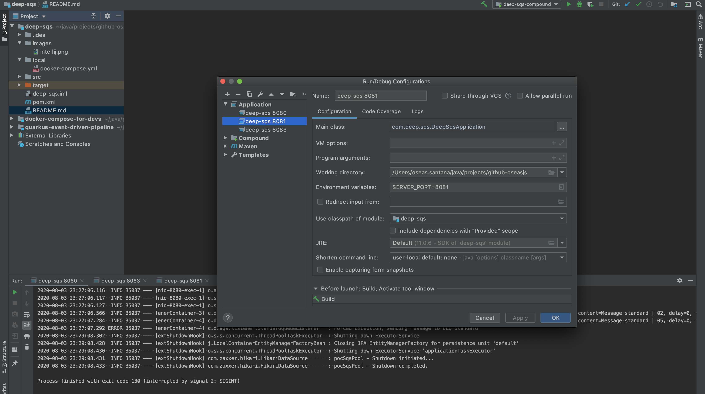
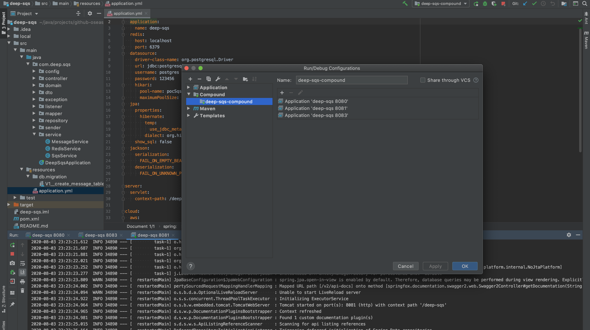

# DEEP-SQS #

Project to evaluate more deeply the main differences between SQS and FIFO queues.


### Dependencies ###

* Maven
* Java 11
* Spring Boot
* Liquibase
* Redis
* SQS
* Flyway
* Lombok
* Localstack (SQS)


### Queues Generation (when do not exists) ###

The class SQSConfig will create the queues if do not exists.

This class is also configured to receive one message per time to keep FIFO messages in order by group


## Localstack and Redis

* There is a docker compose on `./local/docker-compose.yml` with Redis and Localstack containner (SQS service), that could be run with command:

```
TMPDIR=/private$TMPDIR SERVICES=sns,sqs docker-compose up -d
```


### Postgres and Flyway ###

This project uses Postgres and a require an existing database: `deep-sqs`

Flyway will create the table used on this project according SQL script available on folder: `resources/db/migration/V1_*`


### Relevantes Classes ###

* `SQSConfig.java`: Create all required queues (standard and fifo) and configure SimpleMessageListenerContainerFactory to read 1 message per time; 
* `MessageController.java`: Endpoints to test the queues behavior (to be better test, require more the one instance of deep-sqs service running in different ports)
* `SQSService.java`: Send messages to SQS and FIFO queues (Producer)
* `FifoQueueListenner.java`: Receive messages from FIFO queue (Consumer)
* `StandardQueueListenner.java`: Receive messages from Standard queue (Consumer)
* `RedisService.java`: Use Redis to control duplicates message
* `MessageService.java`: Process the received message and save it on DB after some validations.


### How to test this project ###

Para testar o projeto, basta executá-lo e utilizar o endpoint disponibilizado para enviar mensagens para as filas. Porém, para um teste mais completo, recomenda-se executar pelo menos duas instâncias da aplicação, simulando o consumo concorrente das filas. Para isso basta fazer o seguinte:

* Run maven command: `mvn clean package`
* Start more than one instance of deep-sqs service on different ports. Ex: 8080, 8081, 8082

Intellij configuration to run more than one instance of this project:






### About SQS FIFO ###

To keeo the message order on a group, it is mandatory configure the SimpleMessageListenerContainerFactory (on SQSConfig.java class) to allow read only one message per time

```
factory.setMaxNumberOfMessages(1);
``` 


### CURLs Examples ###

```
curl --location --request POST 'localhost:8080/poc-sqs/send/standard/several' \
--data-raw ''
```


``` 
curl --location --request POST 'localhost:8080/poc-sqs/send/standard/several/duplicated' \
--data-raw ''
```

```
curl --location --request POST 'localhost:8080/poc-sqs/send/standard/several/fails' \
--data-raw ''
```


```
curl --location --request POST 'localhost:8080/poc-sqs/send/fifo/several' \
--data-raw ''
```


### Article that inspired this project ###

https://sookocheff.com/post/messaging/dissecting-sqs-fifo-queues/